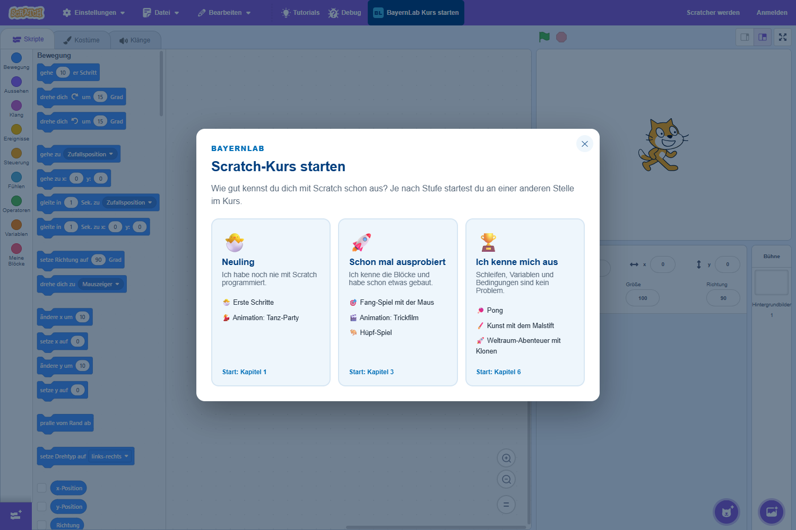
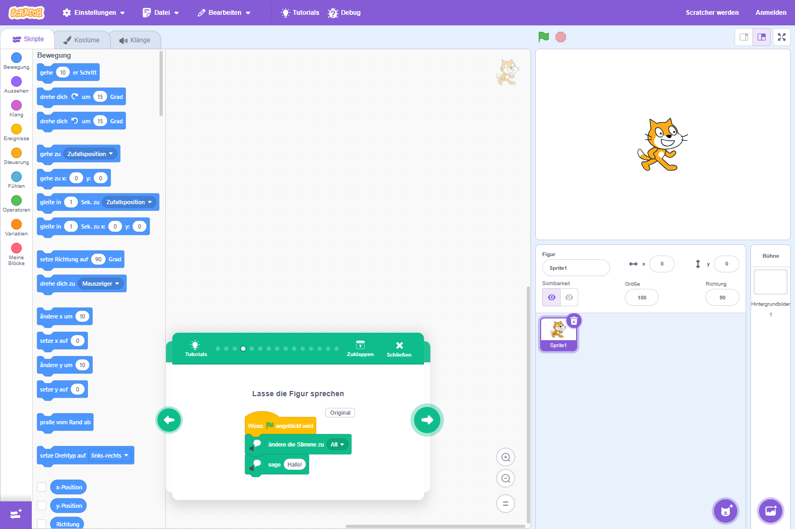
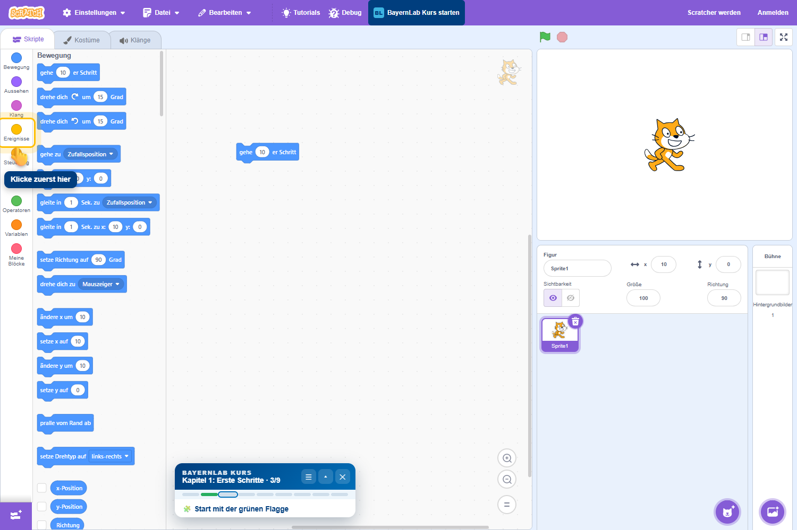
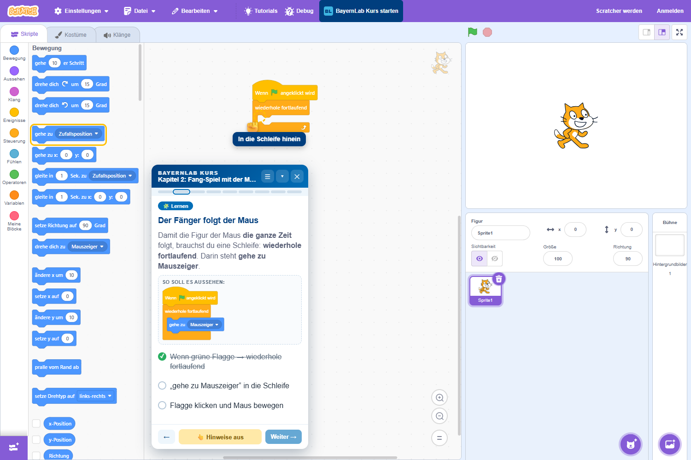
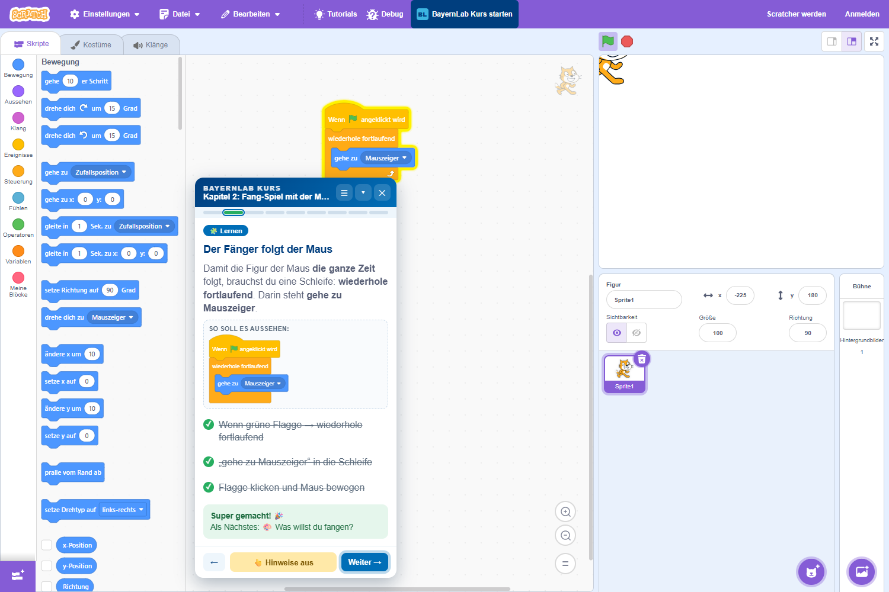

# Scratch auf Deutsch + BayernLab-Kurs

Eine Browser-Erweiterung für **Brave, Chrome und Edge**, die den Scratch-Editor auf
[scratch.mit.edu](https://scratch.mit.edu/projects/editor/) um zwei Dinge erweitert:

1. **Deutsche Scratch-Tutorials:** Die eingebauten Tutorials von Scratch zeigen ihre Blöcke
   sonst immer auf Englisch, auch wenn der Editor auf Deutsch steht. Die Erweiterung ersetzt
   diese Bilder durch dieselben Blöcke auf Deutsch.
2. **BayernLab-Kurs:** Ein geführter Scratch-Kurs mit 8 Kapiteln, direkt im Editor. Er zeigt
   mit animierten Hinweisen, wo geklickt und wohin gezogen wird, und hakt Aufgaben
   automatisch ab, sobald die Blöcke richtig sitzen.

Die Erweiterung braucht kein Konto, keinen Server und sammelt keine Daten.



---

## Inhalt

- [Installation](#installation)
- [Aktualisieren](#aktualisieren)
- [Benutzung](#benutzung)
- [Kursübersicht](#kursübersicht)
- [Tipps für Lehrkräfte](#tipps-für-lehrkräfte)
- [Problemlösung](#problemlösung)
- [Datenschutz](#datenschutz)
- [Für Entwickler: Inhalte anpassen](#für-entwickler-inhalte-anpassen)
- [Danksagung und Hinweise](#danksagung-und-hinweise)

---

## Installation

Die Erweiterung ist nicht im Chrome Web Store. Sie wird als **entpackte Erweiterung**
geladen. Das dauert etwa zwei Minuten.

### Voraussetzungen

- **Brave**, **Google Chrome** oder **Microsoft Edge** in einer aktuellen Version
  (mindestens Chromium 111, also jede Version ab 2023)
- Der Ordner dieser Erweiterung auf dem Computer, zum Beispiel als ZIP entpackt nach
  `Dokumente\scratchExtention`

> **Wichtig:** Der Ordner muss dauerhaft an seinem Platz bleiben. Der Browser lädt die
> Erweiterung bei jedem Start aus diesem Ordner. Wird er gelöscht oder verschoben, ist die
> Erweiterung weg.

### Schritt für Schritt (Brave)

1. Neuen Tab öffnen und `brave://extensions` in die Adresszeile eingeben.
2. Oben rechts den Schalter **Entwicklermodus** einschalten.
3. Auf **Entpackte Erweiterung laden** klicken.
4. Den Ordner `scratchExtention` auswählen, also den Ordner, in dem die Datei
   `manifest.json` liegt, und auf **Ordner auswählen** klicken.
5. In der Liste erscheint **Scratch Tutorials auf Deutsch + BayernLab Kurs**.
   Der Schalter daneben muss eingeschaltet sein.
6. [scratch.mit.edu/projects/editor](https://scratch.mit.edu/projects/editor/) öffnen
   (oder die Seite neu laden, falls sie schon offen war).

Oben in der lila Menüleiste erscheint jetzt der Button **BayernLab Kurs starten**. ✅

### Chrome und Edge

Das Vorgehen ist gleich, nur die Adresse ist anders:

| Browser | Adresse | Schalter |
|---|---|---|
| Brave | `brave://extensions` | Entwicklermodus |
| Chrome | `chrome://extensions` | Entwicklermodus |
| Edge | `edge://extensions` | Entwicklermodus (links in der Seitenleiste) |

### Sprache von Scratch auf Deutsch stellen

Der Kurs ist für den deutschen Scratch-Editor geschrieben. Falls Scratch englisch
angezeigt wird: oben links auf das **Zahnrad-Symbol (Settings)** → **Language** →
**Deutsch**.

---

## Aktualisieren

Wenn es eine neue Version gibt:

1. Die Dateien im Ordner durch die neuen ersetzen (Ordnername und Ort beibehalten).
2. `brave://extensions` öffnen und bei der Erweiterung auf den **Pfeil-Kreis (Neu laden)**
   klicken.
3. Den Scratch-Editor neu laden.

---

## Benutzung

### Deutsche Tutorials

Einfach wie gewohnt in Scratch oben auf **Tutorials** klicken und eine Anleitung
auswählen. Wo die Tutorial-Karte englische Blöcke zeigen würde, erscheinen jetzt deutsche.



- Oben rechts im Bild schaltet **Original** zurück zum englischen Bild, **Deutsch**
  wieder zu den deutschen Blöcken. Die Wahl wird gespeichert.
- 96 von 110 Tutorial-Bildern sind übersetzt. Die übrigen zeigen keine Blöcke,
  sondern nur Bedienschritte (z. B. „Erweiterung hinzufügen“) und bleiben unverändert.
- Die **Videos** in den Tutorials sind weiterhin englisch.

### BayernLab-Kurs starten

1. In der Menüleiste auf **BayernLab Kurs starten** klicken.
2. Die passende **Stufe** wählen:

   | Stufe | Für wen? | Start |
   |---|---|---|
   | 🐣 **Neuling** | Noch nie mit Scratch programmiert | Kapitel 1 |
   | 🚀 **Schon mal ausprobiert** | Kennt die Blöcke, hat schon etwas gebaut | Kapitel 3 |
   | 🏆 **Ich kenne mich aus** | Schleifen, Variablen, Bedingungen sind kein Problem | Kapitel 6 |

3. Das Kursfenster öffnet sich im Programmierbereich. Los geht's!

Die Stufe legt nur fest, wo man einsteigt. Über die Kapitelübersicht ☰ sind jederzeit alle
Kapitel erreichbar.

### Das Kursfenster

| Element | Funktion |
|---|---|
| Blaue Kopfzeile | Gedrückt halten und ziehen, um das Fenster zu verschieben |
| ☰ | Kapitelübersicht: zu jedem Schritt springen, Stufe neu wählen |
| ▾ / ▴ | Fenster **einklappen** auf eine schmale Leiste (bei wenig Platz) bzw. wieder ausklappen |
| ✕ | Kurs schließen. Der Fortschritt bleibt erhalten, über den Menü-Button geht es weiter |
| Fortschrittsbalken | Ein Strich pro Schritt: grün = geschafft, umrandet = aktueller Schritt |
| **So soll es aussehen** | Das Ziel-Skript mit deutschen Blöcken |
| Aufgabenliste | Wird automatisch abgehakt. Aufgaben mit Mauszeiger-Hand hakt man selbst per Klick ab |
| 👆 **Zeig mir wie** | Blendet Hinweise im Editor ein oder aus |
| **Weiter →** | Nächster Schritt. Leuchtet, sobald alles erledigt ist. Man kann auch vorher weiter |



### Hinweise im Editor

Wie bei LEGO Education zeigen animierte Hinweise, was als Nächstes zu tun ist:

- **Gelber, pulsierender Rahmen + Hand 👆:** Hier klicken (z. B. Kategorie, grüne Flagge,
  Figur wählen).
- **Fliegender Block + Faust ✊:** Diesen Block aus der Palette an die markierte Stelle
  ziehen. Der Block wird dabei auf Deutsch angezeigt.
- **„Klicke zuerst hier“:** Der benötigte Block liegt in einer anderen Kategorie.
- **„Scrolle nach unten“:** Der Block ist in der Palette weiter unten.



Bei Neulingen sind die Hinweise automatisch an. Bei **Challenges ⭐** und ab Kapitel 6
erscheinen sie nur auf Knopfdruck. Dort sollen die Kinder es erst selbst versuchen.

Ist ein Schritt geschafft, gibt es Konfetti 🎉 und eine Vorschau auf die nächste Aufgabe:



### Zwischen den Kapiteln: speichern und neu starten

Jedes Kapitel ist ein eigenes Projekt. Wer ein Kapitel abschließt oder in ein anderes
Kapitel wechselt, sieht zuerst den Schritt **💾 Projekt sichern**:

1. **Projekt speichern:** **Datei → Auf deinem Computer speichern**. Mit Scratch-Konto
   geht auch **Datei → Jetzt speichern**.
2. **Neues Projekt anlegen:** **Datei → Neu**. Scratch fragt nach, ob das aktuelle Projekt
   ersetzt werden soll. Das mit **OK** bestätigen.

Die Hinweise zeigen auf das Datei-Menü und den richtigen Eintrag. Beide Aufgaben werden
automatisch abgehakt. Danach startet das nächste Kapitel mit **Los geht's →**. Wer nicht
speichern möchte, kann mit **Überspringen** direkt weiter.

Ist das Projekt schon leer (z. B. direkt nach dem Öffnen des Editors), entfällt dieser
Schritt.

> **Gespeicherte Projekte weiterbauen:** **Datei → Load from your computer** und die
> `.sb3`-Datei auswählen. Diesen Menüpunkt hat Scratch selbst noch nicht übersetzt.

### Schritt-Arten

| Abzeichen | Bedeutung |
|---|---|
| 💡 Info | Erklärung, nichts zu bauen |
| 🧩 Lernen | Neues Konzept mit Anleitung |
| 🎨 Kreativ | Eigene Ideen umsetzen: Figuren, Hintergründe, Effekte |
| 🎮 Spiel | Zwischenspiel: das Gebaute spielen und ein Ziel erreichen |
| ⭐ Challenge | Selbst lösen, Hinweise nur bei Bedarf |

---

## Kursübersicht

| # | Kapitel | Typ | Stufe | Das lernen die Kinder |
|---|---|---|---|---|
| 1 | 🐣 Erste Schritte | Grundlagen | Neuling | Oberfläche, Blöcke ziehen, grüne Flagge, Sprechen, Figuren & Hintergründe, Pfeiltasten, Zwischenspiel „Klick-Jagd“ mit Punkten |
| 2 | 💃 Tanz-Party | **Animation** | Neuling | Kostüme & Daumenkino-Prinzip, Wiederholen, Warten, Musik in Schleifen, Grafikeffekte, Gleiten |
| 3 | 🎯 Fang-Spiel mit der Maus | Spiel | Schon mal ausprobiert | Endlosschleife, Mauszeiger folgen, falls/dann, Berührung, Variablen, Stoppuhr, Gegner |
| 4 | 🎬 Trickfilm | **Animation** | Schon mal ausprobiert | Dialoge, Nachrichten senden/empfangen, Szenenwechsel, zeigen/verstecken, interaktive Geschichte mit Fragen |
| 5 | 🦘 Hüpf-Spiel | Spiel | Schon mal ausprobiert | Springen mit Schleifen, Hindernisse, Kollision, Punkte, Challenge: echte Schwerkraft |
| 6 | 🏓 Pong | Spiel | Ich kenne mich aus | Richtung & Abprallen, Steuern mit Maus-x, Game Over per Farbe, Tempo-Variable |
| 7 | 🖌️ Kunst mit dem Malstift | Kunst | Ich kenne mich aus | Erweiterung Malstift, Geometrie, verschachtelte Schleifen, eigene Blöcke, Malprogramm |
| 8 | 🚀 Weltraum-Abenteuer mit Klonen | Spiel | Ich kenne mich aus | Tastenabfrage in Schleifen, Klone, Zufallszahlen, wiederhole bis, Laser-Challenge |

Jedes Kapitel endet mit einer **Kreativ-Aufgabe**, in der die Kinder das Projekt zu ihrem
eigenen machen. Danach gibt es eine 🏆-Seite mit Übergang ins nächste Kapitel.

---

## Tipps für Lehrkräfte

- **Ein Projekt pro Kapitel:** Der Kurs führt zwischen den Kapiteln automatisch durch
  „Speichern“ und „Datei → Neu“. Das ist wichtig, weil die automatischen Prüfungen das
  ganze Projekt ansehen. Alte Skripte aus früheren Kapiteln könnten sonst Aufgaben
  fälschlich abhaken.
- **Wohin wird gespeichert?** Ohne Scratch-Konto landet die `.sb3`-Datei im
  Download-Ordner, je nach Browser auch mit Nachfrage nach dem Speicherort. Gut ist ein
  eigener Ordner pro Kind, z. B. auf dem USB-Stick oder im Schulnetz. Mit Konto speichert
  Scratch online im Profil.
- **Fortschritt pro Browser:** Der Kursfortschritt wird im Browser gespeichert, nicht im
  Scratch-Projekt. An geteilten Schul-PCs übernimmt das nächste Kind den Stand. Mit
  ☰ → **Stufe neu wählen** beginnt man von vorn. Am besten hat jedes Kind ein eigenes
  Browser-Profil.
- **Selbst abhaken:** Manche Aufgaben kann die Erweiterung nicht prüfen, z. B. „rote Linie
  gemalt“ oder „Spiel jemandem vorgeführt“. Diese hakt das Kind per Klick ab. Ein guter
  Moment für einen kurzen Blick der Lehrkraft.
- **Wenig Bildschirmplatz:** Fenster mit ▾ einklappen oder an den Rand ziehen. Bei kleinen
  Fenstern blendet der Kurs die Vorschau-Blöcke automatisch aus.
- **Ohne Hinweise üben:** 👆 **Hinweise aus** schaltet die Animationen ab. Das ist gut für
  Kinder, die es allein schaffen wollen.

---

## Problemlösung

**Der Button „BayernLab Kurs starten“ fehlt.**
- Ist die Erweiterung in `brave://extensions` eingeschaltet?
- Die Erweiterung läuft nur auf `https://scratch.mit.edu`, nicht in der Scratch-Desktop-App
  und nicht auf anderen Scratch-Seiten wie TurboWarp.
- Den Editor einmal neu laden (F5).
- Bei sehr schmalem Fenster passt der Button eventuell nicht mehr in die Menüleiste.
  Fenster breiter ziehen oder mit Strg + Minus herauszoomen.

**Die Hinweise zeigen an die falsche Stelle.**
- Die Hinweise orientieren sich an der Bildschirmposition. Nach dem Scrollen oder Zoomen
  im Programmierbereich passen sie sich innerhalb einer Sekunde an.
- Mit dem **=**-Knopf unten rechts im Programmierbereich die Ansicht zurücksetzen.

**Eine Aufgabe wird nicht abgehakt, obwohl alles stimmt.**
- Sitzen die Blöcke wirklich zusammen? Lose Blöcke, die nur nah beieinander liegen,
  zählen nicht.
- Stimmt der Menüwert? Beispiel: „gehe zu **Mauszeiger**“ statt „Zufallsposition“.
- Notfalls mit **Weiter →** einfach fortfahren. Man kann jeden Schritt überspringen.

**„Projekt speichern“ wird nicht abgehakt.**
Das Abhaken passiert beim Klick auf den Speichern-Eintrag im Datei-Menü. Wurde stattdessen
mit Strg + S oder anders gespeichert, einfach **Los geht's →** oder **Überspringen**
klicken.

**Das Kursfenster verdeckt etwas.**
Fenster an der blauen Kopfzeile wegziehen oder mit ▾ einklappen.

**Die deutschen Tutorial-Bilder erscheinen nicht.**
Nur Tutorial-Schritte mit Blöcken werden ersetzt. Prüfen, ob oben rechts im Bild
**Deutsch** steht. Dann ist gerade das Original ausgewählt.

**Nach einem Scratch-Update funktioniert etwas nicht mehr.**
Die Erweiterung nutzt interne Strukturen des Scratch-Editors. Größere Umbauten bei Scratch
können eine Anpassung nötig machen. Siehe [Für Entwickler](#für-entwickler-inhalte-anpassen).

**Browser meldet „Erweiterungen im Entwicklermodus deaktivieren“.**
Chrome und Edge zeigen diesen Hinweis manchmal beim Start. Einfach schließen
(**Abbrechen** bzw. **Nicht deaktivieren**).

---

## Datenschutz

- Die Erweiterung läuft **nur** auf `https://scratch.mit.edu`.
- Sie sendet **keine Daten** irgendwohin und lädt nichts aus dem Internet nach. Alle
  Dateien, auch die Block-Grafiken, sind im Ordner enthalten.
- Gespeichert werden nur der Kursfortschritt und die Einstellung „Original/Deutsch“ im
  lokalen Speicher des Browsers (`localStorage` von scratch.mit.edu).
- Zum Zurücksetzen: in den Browser-Einstellungen die Website-Daten von scratch.mit.edu
  löschen, oder im Kurs ☰ → **Stufe neu wählen**.

---

## Für Entwickler: Inhalte anpassen

### Projektstruktur

```
scratchExtention/
├── manifest.json            Erweiterungs-Manifest (Manifest V3)
├── content.js / .css        Deutsche Tutorial-Bilder
├── course/
│   ├── course-data.js       ← Kursinhalte: Kapitel, Schritte, Aufgaben, Hinweise
│   ├── course.js            Kurs-Engine: Button, Stufenwahl, Fenster, Hinweise, Prüfungen
│   └── course.css           Gestaltung (BayernLab-Farben)
├── data/steps-de.js         Erzeugt: deutsche Blöcke für die Scratch-Tutorials
├── lib/
│   ├── scratch-access.js    Zugriff auf Redux-Store, VM und Workspace von Scratch
│   ├── scratchblocks.min.js Rendert Blöcke aus Text (scratchblocks 3.7.1, MIT)
│   └── scratchblocks-de.js  Deutsche Übersetzung für scratchblocks
├── tools/
│   ├── source-en.json       Englische Vorlage der 110 Tutorial-Bilder
│   ├── build-data.mjs       Erzeugt data/steps-de.js (inkl. Wörterbücher)
│   └── check-course.mjs     Prüft alle Block-Skripte im Kurs
└── docs/                    Screenshots für diese Anleitung
```

### So funktioniert es

- Alle Skripte laufen als Content-Scripts in der Seite selbst (`"world": "MAIN"`). Nur so
  kommen sie an die Interna von Scratch.
- `lib/scratch-access.js` findet über die React-Struktur der Seite den **Redux-Store**
  von Scratch. Darüber erreicht es die **Scratch-VM** und den **Blockly-Workspace**.
- **Tutorials:** Der Store verrät, welcher Tutorial-Schritt offen ist, z. B.
  `moveArrowKeysLeftRight`. Das Bild wird durch den passenden Eintrag aus
  `data/steps-de.js` ersetzt.
- **Kurs:** Alle 200 ms liest die Engine die Blöcke aller Figuren aus der VM und prüft die
  Aufgaben des aktuellen Schritts. Hinweise werden an echte Elemente im Editor geheftet,
  z. B. Kategorien, Blöcke in der Palette oder die grüne Flagge.

### Werkzeuge einrichten

Benötigt [Node.js](https://nodejs.org/) ab Version 18:

```bash
npm install        # installiert scratchblocks für die Werkzeuge
npm run check      # prüft alle Block-Skripte in course/course-data.js
npm run build      # erzeugt data/steps-de.js neu aus tools/source-en.json
```

Nach jeder Änderung die Erweiterung in `brave://extensions` neu laden und den Editor
aktualisieren.

### Einen Kursschritt schreiben

Kapitel und Schritte stehen in `course/course-data.js`. Ein Schritt sieht so aus:

```js
{
    kind: 'learn',                       // info | learn | creative | game | challenge
    title: 'Der Fänger folgt der Maus',
    text: '<p>Erklärung mit <b>HTML</b>.</p>',
    // Ziel-Skript in englischer scratchblocks-Syntax – wird automatisch deutsch angezeigt.
    // Menüwerte direkt deutsch schreiben.
    blocks: 'when flag clicked\nforever\n  go to (Mauszeiger v)\nend',
    tasks: [
        {text: 'Schleife unter die Flagge', check: c => inScript(c, 'control_forever', 'event_whenflagclicked')},
        {text: '„gehe zu Mauszeiger“ in die Schleife',
            check: c => inside(c, 'motion_goto', 'control_forever', (t, b) => c.menu(t, b, 'TO') === '_mouse_')},
        {text: 'Ich habe es jemandem gezeigt', manual: true}   // selbst abhaken
    ],
    hints: [   // es wird immer der erste noch nicht erledigte Hinweis gezeigt
        {drag: 'control_forever', to: 'under:event_whenflagclicked', ghost: 'forever\nend',
            text: 'Schleife darunter', done: c => inScript(c, 'control_forever', 'event_whenflagclicked')},
        {target: 'ws:motion_goto', text: 'Wähle „Mauszeiger“', done: c => /* … */ true}
    ]
}
```

**Hinweis-Ziele** (`target`): `cat:<kategorie>`, `fly:<opcode>`, `ws:<opcode>`, `flag`,
`stage`, `spriteAdd`, `backdropAdd`, `spriteList`, `stageSelector`, `extensionAdd`,
`tab:code|costumes|sounds`, `flybtn:<Beschriftung>`, `palette`, `workspace`.

**Zieh-Ziele** (`to`): `ws` (freie Fläche), `under:<opcode>`, `above:<opcode>`,
`inside:<opcode>` (in einen C-Block), `cond:<opcode>` (in die Lücke eines Blocks),
`ws:<opcode>` (auf einen Block).

**Prüf-Hilfen** im Kontext `c`: `c.find(opcode)`, `c.inC(t, b, outerOpcode)`,
`c.hatOf(t, b)`, `c.menu(t, b, input)`, `c.text(t, b, input)`, `c.field(b, name)`,
`c.plugged(t, b, input)`, `c.vars()`, `c.sprites`, `c.flags`, `c.keys`, `c.moved()`,
`c.backdropChanged()`, `c.tab(name)`, `c.tabSeen(name)`, `c.extension(id)`,
`c.spritesWith(opcode)`, `c.editingHas(opcode)`, `c.categoryOpen(id)`.
Dazu die Kurzformen `inScript`, `inside`, `keyScript`, `newSprites` und `userVar` oben in
der Datei.

Opcodes wie `motion_goto` oder `control_forever` stammen aus der Scratch-VM. Eine Liste
gibt es im [scratch-vm-Quellcode](https://github.com/scratchfoundation/scratch-vm/tree/develop/src/blocks).

### Ein neues Kapitel hinzufügen

1. In `course/course-data.js` ein Objekt in `chapters` einfügen, mit eindeutiger `id`,
   `title`, `level` (`neuling` | `probiert` | `profi`), `type`, `icon`, `autoHints` und
   `steps`.
2. Die Reihenfolge im Array ist die Reihenfolge im Kurs. Gespeichert wird über die `id`,
   deshalb verschieben neue Kapitel den Fortschritt nicht.
3. `npm run check` ausführen und das Kapitel im Editor durchspielen.

### Tutorial-Übersetzungen ändern

- Block-Code der Tutorial-Bilder (englisch): `tools/source-en.json`
- Übersetzungen von Menüwerten, Figurennamen und Sprechtexten: Wörterbücher `MENU`,
  `NAMES`, `TEXT` und `NOTES` in `tools/build-data.mjs`
- Danach `npm run build`

---

## Danksagung und Hinweise

- Blöcke werden mit [scratchblocks](https://github.com/scratchblocks/scratchblocks) von
  Tim Radvan gezeichnet (MIT-Lizenz, siehe `lib/scratchblocks-LICENSE`).
- Die Tutorial-Zuordnung basiert auf dem Quellcode von
  [scratch-gui](https://github.com/scratchfoundation/scratch-gui).
- Scratch ist ein Projekt der Scratch Foundation in Zusammenarbeit mit der Lifelong
  Kindergarten Group am MIT Media Lab. Diese Erweiterung ist ein unabhängiges Projekt des
  BayernLab und steht in keiner Verbindung zur Scratch Foundation.
